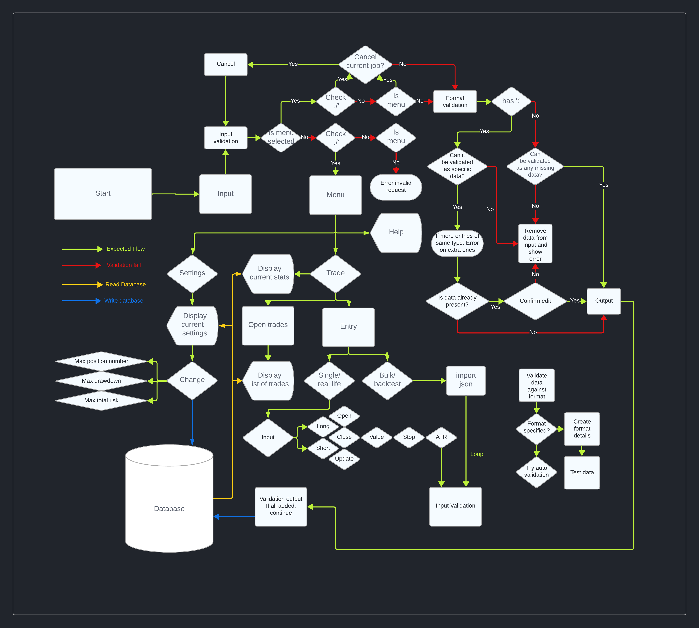

# Trading Book System

[Live project can be viewed here](https://trading-book-de510f70748d.herokuapp.com/)

The Trading Book System is an open-source interactive command-line tool designed to help users manage and track their trading activities. Key features include logging trades, updating settings, viewing current statistics, and seamless integration with Google Sheets for data storage and retrieval.



# Table of Contents

* [Description](#description)
* [User Experience](#user-experience)
    * [User Story](#user-story)
* [Design](#design)
* [Features](#features)
    * [Existing Features](#existing-features)
    * [Future Features](#future-features)
* [How to Use](#how-to-use)
    * [Example of Valid Commands](#example-of-valid-commands)
* [Error Handling](#error-handling)
    * [Initialization Errors](#initialization-errors)
    * [Read and Write Operations](#read-and-write-operations)
    * [User Input Validation](#user-input-validation)
    * [Confirmation and Navigation](#confirmation-and-navigation)
* [Technology Used](#technology-used)
    * [Language](#language)
    * [Frameworks, Libraries and Programs](#frameworks-libraries-and-programs)
* [Deployment](#deployment)
* [Testing](#testing)
    * [Manual Testing](#manual-testing)
* [Future optimizations](#future-optimizations)
* [Credits](#credits)
    * [Code](#code)
    * [Content](#content)
* [Acknowledgements](#acknowledgements)

# User Experience

The Trading Book System is designed with the user in mind, providing a clear and structured interface for managing trades. Users can easily input trade data, view current settings, and check the status of their trades. The system ensures data integrity and provides helpful feedback, making it a reliable tool for both novice and experienced traders.

## User Story

As a trader, I want to be able to log my trades efficiently, update my trading settings, and view my current trades and statistics, so that I can manage my trading activities effectively.

# Design

The design of the Trading Book System is based on a flowchart that outlines the expected flow of operations, validation processes, and interactions with the Google Sheets database. This ensures a seamless user experience and efficient data management.

Key design principles include:
- **User-Centric Design**: Focused on providing clear prompts and feedback.
- **Modular Architecture**: Separation of concerns through different classes and methods.
- **Robust Error Handling**: Comprehensive error handling to ensure reliability.

Errors are displayed in red, and successes are displayed in green. Confirmations are required before moving away from any jobs or completing a new trade entry input.

# Features

* **Smart Input Interpreter**: Enhances user experience by simplifying data entry and minimizing errors. It processes and validates user inputs intelligently, ensuring correct formatting and alignment with system requirements. For example, the Entry function allows users to input data for other data requests within the same job. Confirmation requests are flexible, accepting variations like "YEAH" or "NOPE" in addition to simple "y/n" inputs.
* **Trade Entry**: Log new trades with details such as action, asset, type, price, stop, and ATR. Also allows bulk import by inputting JSON format according to specifications.
* **Settings Management**: Update and view settings such as position number, drawdown, and total risk. This feature currently serves as a showroom and does not affect trades but is prepared for future integrations.
* **Trade Check**: View current open trades and their statistics. Open trades guide future entries, ensuring no multiple trades are opened for the same asset. Close and update entries are only allowed on assets with an open trade.
* **Data Validation**: Ensures all inputs meet specified formats and constraints. The system handles data smartly, moving data around to fit correctly, and prompts the user for new data when auto-validation is not possible.
* **Help and Tips**: Accessible from any part of the code, the help function adjusts its content according to the current context, providing relevant instructions and tips.

## Future features

* **Advanced Analytics**: Integrate more advanced analytics for trade performance and risk management.
* **Automated Alerts**: Add functionality for automated alerts based on trade conditions identified.
* **Auto Execution of Trades**: Enable fully automated trading via API requests to stock exchanges.
* **Automate the whole trade chain of processes**: From pricing patterns reading to order execution at the exchagen, the full process can be automated. Alerts of moves can be sent via API to Telegram to keep the user up to date, while the program convert price patterns into money, by reading patterns, creating signals of entry and exit, position sizing, risk management, API call to communicate the new move and API call to execute the same at the exchange. Almost a whole Commodity Trading Fund. 
* **Work as an installed module on a Linux server**: Integrating the created functions with Bash commands can significantly enhance user capabilities. By allowing direct parsing through logs while interacting with the program, users can achieve a new level of control and efficiency in their workflows. Security, scalability and performance would be significantly improved in a setup like that.

# How to use

1. **Start the Application**: Run the main script to start the Trading Book System.
2. **Enter Commands**: Use the command line interface to enter commands for logging trades, updating settings, or checking current trades.
3. **Follow Prompts**: The system will prompt you for necessary inputs and provide feedback on actions taken.
4. **View Results**: Use the `check` command to view current open trades and their details.
5. **Type help**: Type help at any time to get insights on how to input the correct data or navigate around.

## Example of valid Commands

- **Logging a Trade**:
```
entry
./entry
entry type:short open
./entry open asset:spy short 50000 45000 atr:1%
entry asset:btc long 50000 stop:45000 3% open
```

* Updating Settings:
```
./set position_num:5 drawdown:10% total_risk:5%
set
```

* Checking Open Trades:
```
./check
```

* Help:
```
./help
help
./help entry
help ./set
help check
exit ./help
```

* Cancel:
```
./cancel
cancel
cancel y      (this one forces it thorugh without asking confirmation)
```

# Error handling

The Trading Book System includes robust error handling mechanisms to ensure that the application can gracefully handle and recover from various error scenarios. 

By implementing these error handling strategies, the Trading Book System ensures that users receive clear, informative feedback and that the application remains stable and reliable, even when unexpected situations occur.

Below are the key aspects of how error handling is managed in the system:

## Initialization Errors

During the initialization of the DataBaseActions class, several types of errors are caught and handled to ensure the system can provide informative feedback and maintain stability:

* DefaultCredentialsError: Occurs when the credentials file is not found or cannot be loaded. The system prints a message indicating the failure to load credentials.
* GoogleAuthError: Handles authentication failures with the Google API. An error message is displayed to inform the user.
* APIError: Catches issues related to the gspread client authorization. An appropriate error message is printed.
* General Exception: Any unexpected errors during initialization are caught and logged with a generic message.

## Read and Write Operations

Error handling is also implemented for read and write operations to ensure data integrity and provide clear feedback to the user:

* Read Errors: When reading data from a worksheet, the system catches APIError and general exceptions, printing an error message and returning None.
* Write Errors: When appending data to a worksheet, the system handles APIError and general exceptions similarly, ensuring users are informed if the write operation fails.

## User Input Validation

User input is validated through various methods to ensure correctness and provide meaningful error messages when invalid data is encountered:

* Format Validation: The system checks if inputs match the expected format using regular expressions. If validation fails, an error message is printed, and None is returned.
* Auto-Validation: Inputs that can be automatically validated are processed and corrected if possible. If validation fails, the user is prompted to re-enter the data.

## Confirmation and Navigation

The system ensures that before moving away from a current job or completing a new trade entry, the user is asked for confirmation:

* Confirmation Requests: The system uses a yes_or_no function to interpret various forms of affirmative and negative responses, ensuring flexibility in user input.

# Technology used

## Language

* Python

## Frameworks, Libraries and Programs

* **gspread**: For interacting with Google Sheets.
* **Google OAuth2**: For authentication and authorization with Google APIs.
* **json**: For handling JSON data.
* **datetime**: For managing date and time data.
* **re**: For allowing usage of regular expressions in format interpretation and validation.
* **[LucidChart](https://lucid.app)**: For flowchart creation and project initial planning.
* **Visual Studio Code**: As the integrated development environment (IDE) of choice.
* **Google Sheets**: Used as a database for storing and managing trade data. The project’s Google Sheet can be viewed [here](https://docs.google.com/spreadsheets/d/11yF7zZ4YkLPFGiV84rwFdnI6vDUi4uwlRiTczyG5f3U/edit?usp=sharing)

# Deployment

The Code Institute Python Essentials Template was utilized for this project to ensure the Python code can be executed in a terminal within a browser.

To deploy the application on Heroku:

1. Visit the Heroku website, log in, or create a new account.
2. On the dashboard, click "New" and select "Create new app."
3. Enter a unique app name and choose a region.
4. Click "Create app."
5. Navigate to the "Settings" tab and find "Config Vars."
6. Click "Reveal Config Vars," add "PORT" as a key with the value "8000," and click "Add."
7. Scroll down to the "Buildpacks" section, click "Add buildpack," and select "Python."
8. Repeat step 7 to add "Node.js," ensuring "Python" is listed first.
9. Scroll to the top and select the "Deploy" tab.
10. Choose GitHub as the deployment method, then search for your repository and click "Connect."
11. Scroll down and either "Enable Automatic Deploys" to update the code each time it is pushed to GitHub, or choose "Manual Deploy" for manual updates.

# Testing

Testing was primarily conducted using the VSC (Visual Studio Code) terminal. Given the complexity of the code, testing and fixes were integrated into the development process. The project initially started with a set of loose functions and later transitioned to an object-oriented programming (OOP) structure for better management and readability.

PEP8 compliance was first ensured after completing the Entry feature, which was the initial significant feature of the program. From that point onward, each commit was only accepted if the code was 100% PEP8 compliant. This practice facilitated maintaining clean and standardized code throughout the development process.

Errors were identified early and addressed promptly, adhering to the daily work schedule. Dedicated testing time was allocated each day to ensure thorough validation. Inspired by the principles outlined in the "Clean Code" book, the primary objective for each function was to ensure functionality. Once the function was working correctly, optimizations were made to keep the code concise, well-commented, and easily maintainable.

## Manual testing

| **Feature** | **Action** | **Expected Result** | **Actual Result** |
|-------------|------------|---------------------|-------------------|

# Future optimizations

Over the course of nearly 200 hours dedicated to this project, numerous objects and functions were created with reusability in mind. A significant portion of the code was designed to be reusable in other features or projects. However, some objects contain multiple methods and would benefit from being broken down into smaller, more manageable objects.

Additionally, some functions currently perform multiple tasks. Due to time constraints, these functions had to be left as they are. This section of the README file has been included to highlight areas for future refactoring and improvement. Reworking these functions and objects will enhance code modularity, readability, and maintainability.

# Credits

## Code

* **gspread**: For interacting with Google Sheets.
* **Google OAuth2**: For authentication and authorization.
* **[Code Institute's PEP8 validator](https://pep8ci.herokuapp.com/)**: For reviewing code formatting for PEP8 validation.
* **[Black](https://pypi.org/project/black/)**: For reviewing code formatting for PEP8 validation.
* **[Clean Code in Python](https://www.amazon.co.uk/Clean-Code-Python-maintainable-efficient)**: As a reference for maintainable and efficient Python coding.

## Content

* **[ChatGPT](https://chat.openai.com/)**: For text reviews and copywriting assistance.

# Acknowledgements

* **Gareth Mc Girr**: My mentor, for all the help and advice throughout the project.
* **Code Institute**: For all the training and guidance.
* **WP Engine**: My current employer, for providing all the support necessary and allowing great networking.
